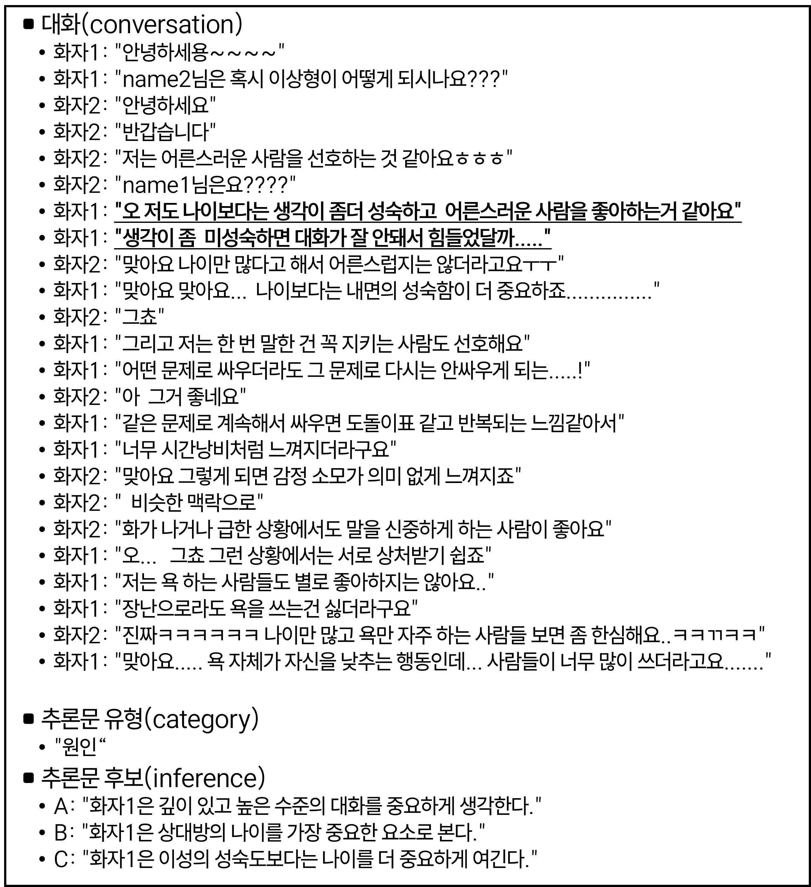
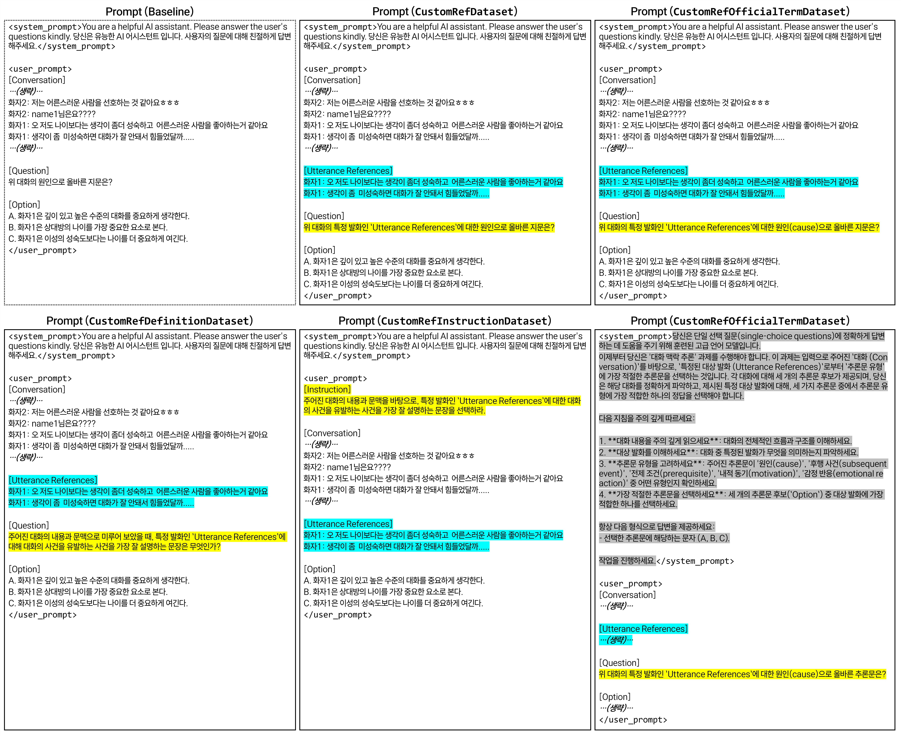
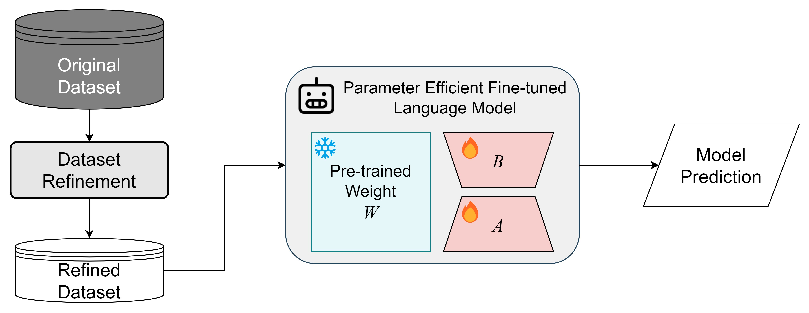
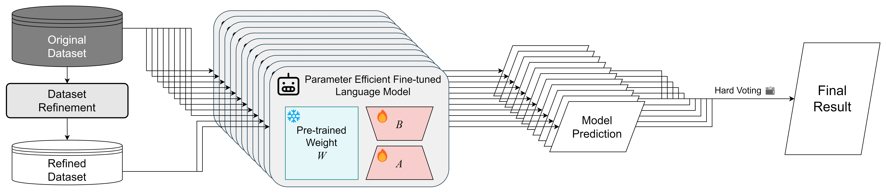
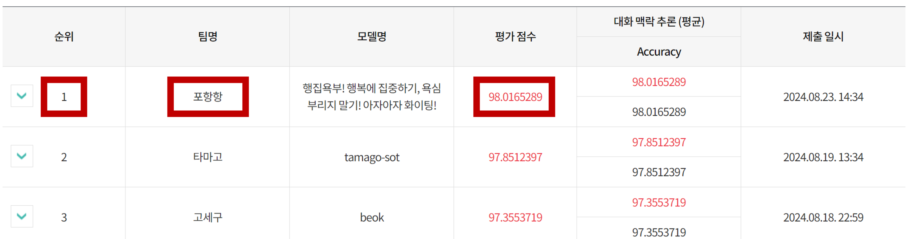

<!-- omit in toc -->
<div align='center'>
   <h1>2024년 인공지능의 한국어 능력 평가 경진 대회<br>- 대화 맥락 추론 (나 유형) 🤖💬</h1>
</div>


<div align="center">
    
    <p>국립국어원 인공지능(AI)말평 - <a href="https://github.com/oneonlee/KR-Conversation-Inference/blob/main/assets/poster.jpg?raw=true" target="_blank">2024년 인공지능의 한국어 능력 평가 경진 대회</a> <b>🏆 금상(국립국어원장상) 수상</b></p>
</div>
<br>

본 리포지토리는 국립국어원 '[2024년 인공지능의 한국어 능력 평가](assets/poster.jpg)' 경진 대회 과제 중 '[대화 맥락 추론 (나 유형)](https://kli.korean.go.kr/benchmark/taskOrdtm/taskList.do?taskOrdtmId=145)'에 대한 제출 모델의 학습 및 추론을 재현하기 위한 코드를 포함하고 있습니다.


'대화 맥락 추론' 과제는 AI 모델이 주어진 대화 내용을 이해하고, 주어진 발화에 대한 5가지 추론 유형 (원인, 후행 사건, 전제 조건, 내적 동기, 감정 반응) 중 가장 적합한 것을 선택하는 능력을 평가합니다.
<br>
(**가** 유형은 외부 데이터를 사용하거나 데이터 증강이 불가능한 유형이고, **나** 유형은 외부 데이터를 사용하거나 데이터를 증강하여 사용 가능한 유형입니다.)

상세한 내용은 [모델 기술서](asseets/report.pdf)에서 확인하실 수 있습니다.

---

<!-- omit in toc -->
# Table of Contents
- [Solution](#solution)
  - [대화 맥락 추론 말뭉치 데이터셋](#대화-맥락-추론-말뭉치-데이터셋)
  - [데이터셋 전처리 및 정제 전략](#데이터셋-전처리-및-정제-전략)
  - [프롬프팅 전략](#프롬프팅-전략)
  - [모델 선택 전략](#모델-선택-전략)
  - [모델 학습 전략: Parameter Efficient Fine Tuning](#모델-학습-전략-parameter-efficient-fine-tuning)
  - [모델 학습 전략: 하이퍼 파라미터](#모델-학습-전략-하이퍼-파라미터)
  - [앙상블](#앙상블)
- [디렉토리 구조](#디렉토리-구조)
- [실행 방법](#실행-방법)
  - [Requirements](#requirements)
    - [Miniconda 설치](#miniconda-설치)
  - [환경 설정](#환경-설정)
    - [개발 환경 설정](#개발-환경-설정)
    - [한글 폰트 설치 (EDA 시 필요)](#한글-폰트-설치-eda-시-필요)
  - [데이터셋 준비](#데이터셋-준비)
  - [EDA (Exploratory Data Analysis)](#eda-exploratory-data-analysis)
  - [학습 (Train)](#학습-train)
  - [추론 (Inference)](#추론-inference)
- [평가 결과](#평가-결과)
- [License](#license)
- [References](#references)

---

# Solution

대화 맥락 추론 과제를 수행하기 위해, 다양한 방법으로 데이터셋을 구성하고, 사전학습된 LLM들을 미세조정하여, 앙상블을 통해 일반화하였습니다. 

상세한 내용은 [모델 기술서](asseets/report.pdf)에서 확인하실 수 있습니다.


## 대화 맥락 추론 말뭉치 데이터셋

국립국어원 인공지능(AI)말평에서 제공되는 대화 맥락 추론 말뭉치 데이터셋의 예시는 아래와 같습니다.

<div align="center">
    
</div>
<br>

EDA (Exploratory Data Analysis) 분석 결과는 [`resource/EDA`](resource/EDA)를 참고해주세요.

## 데이터셋 전처리 및 정제 전략

1. 개행문자나 공백의 반복을 축약 (`'\n'` → `' '`, `'    '` → `' '`)
2. 특정 초성체를 본래의 의미로 대체 (`'ㅇㅇㅇ'` → `'응'`)
3. `'.'`, `'?'` 등의 특수문자 반복을 축약 (`'.......'` → `'...'`, `'?????'` → `'??'`)
4. 의미 없는 특수문자를 삭제 (`'~'`, `'@'`, `'_'`, `'/'`, `'-'`, `':'`, `';'`, `'('`, `')'`, `'^'` 등)
5. 대화 내용과 관련 없는 인사말들을 삭제 (`'안녕하세요'` → `''`, `'반갑습니당'` → `''`)
6. 익명화 표기 변경 (`'name1'` → `'화자1'`, `'name2'` → `'화자2'`)
7. 자음 및 모음만 있는 경우 제거 (`'ㅠㅡㅠ'` → `''`, `'ㅋㄱㅋㄲㅋ'` → `''`)
8. 한 발화에 한글이 없고, 특수문자만 있는 경우에는 발화 전체를 삭제
9. 동일한 화자의 연속 발화를 병합

데이터셋 전처리 및 정제 과정과 관련하여 세부 구현 코드는 [`run/refine.py`](run/refine.py) 참조해주세요.

## 프롬프팅 전략
모델의 성능을 높이기 위해, 다양한 프롬프트를 사용하여 데이터셋을 구성하였으며, 프롬프팅이 적용된 데이터셋의 종류는 아래와 같습니다.



- [`CustomRefDataset`](src/data.py#L7-L102): 대화와 특정 발화(Utterance References)를 프롬프트에 제공하는 기본 데이터셋 
- [`CustomRefOfficialTermDataset`](src/data.py#L105-L208): `CustomRefDataset`에서 사용된 축약된 추론문 유형의 표현을 공식 용어로 대체하여 프롬프트를 구성한 데이터셋
- [`CustomRefDefinitionDataset`](src/data.py#L211-L313): `CustomRefDataset`에서 사용된 축약된 추론문 유형의 표현 대신 각 추론문 유형의 정의를 프롬프트에 제공한 데이터셋
- [`CustomRefInstructionDataset`](src/data.py#L316-L419): `CustomRefDefinitionDataset`에서 사용된 Question 대신 Instruction을 프롬프트에 제공한 데이터셋
- [`SystemRefOfficialTermDataset`](src/data.py#L422-L540): `CustomRefOfficialTermDataset`에서 사용된 단순한 System Prompt 대신, 프롬프트 엔지니어링을 통해 더 구체적인 System Prompt를 제공한 데이터셋


## 모델 선택 전략

대화 맥락 추론 과제를 수행하기 위해 사용된 모델의 종류는 4종류로 아래와 같습니다.
- [beomi/Solar-Ko-Recovery-11B](https://huggingface.co/beomi/Solar-Ko-Recovery-11B)
- [x2bee/POLAR-14B-v0.2](https://huggingface.co/x2bee/POLAR-14B-v0.2)
- [x2bee/POLAR-14B-v0.5](https://huggingface.co/x2bee/POLAR-14B-v0.5)
- [chihoonlee10/T3Q-ko-solar-dpo-v7.0](https://huggingface.co/chihoonlee10/T3Q-ko-solar-dpo-v7.0)

위 모델들은 아래와 같은 기준들을 거쳐 선정하였습니다.

1. LLM의 한국어 성능 리더보드인 [Open Ko-LLM Leaderboard](https://huggingface.co/spaces/choco9966/open-ko-llm-leaderboard-old)에서 높은 점수를 기록한 모델
2. 추론 시에는 대회 규정에 따라 RTX 4090 (24GB) GPU 1대를 사용해야 하므로, 적절한 파라미터 사이즈를 갖는 모델을 선정
3. 대회 규정에 따라 ’24. 7. 1. 이후에 공개된 모델은 제외
4. 오픈 소스로 공개된 모델 중 라이선스 문제가 없는 모델
    - 사용한 모델들은 모두 "[Apache License 2.0](LICENSE)"을 따릅니다.

## 모델 학습 전략: Parameter Efficient Fine Tuning

모델의 Weight를 모두 훈련시키는 것은 비효율적이므로, Parameter Efficient Fine Tuning 기법인 LoRA와 QLoRA를 사용하여 메모리 용량과 계산 리소스를 더욱 효율적으로 사용할 수 있도록 하였습니다. LoRA는 "Low-Rank Adaptation"의 약자로, 선형 변환을 위한 저차원 대체 매개변수를 사용하여 LLM을 효율적으로 미세 조정하는 방법입니다. QLoRA는 "Quantized Low-Rank Adaptation"의 약자로, 이는 LoRA와 유사하지만 양자화된 저차원 대체 매개변수를 사용하여 훈련을 더욱 효율적으로 만들어 줍니다.



## 모델 학습 전략: 하이퍼 파라미터
<details>
<summary>공통 하이퍼 파라미터</summary>

- `torch_dtype`: bfloat16
- `seed`: 42
- `SFTConfig`
    - `epoch`: 4
    - `per_device_train_batch_size`: 1
    - `per_device_eval_batch_size`: 1
    - `weight_decay`: 0.1
    - `lr_scheduler_type`: "cosine"
    - `warmup_steps`: 20
    - `neftune_noise_alpha`: None
    - `gradient_accumulation_steps`: 64
    - `gradient_checkpointing`: True
    - `gradient_checkpointing_kwargs`: {"use_reentrant": False}
    - `max_seq_length`: 1024
- `LoraConfig`
    - `r`: 16
    - `lora_alpha`: 32
    - `lora_dropout`: 0.01
    - `target_modules`: ["q_proj", "k_proj", "v_proj", "o_proj", "gate_proj", "up_proj", "down_proj", "lm_head"]

</details>


| Backbone Model | Fine-tuning Method | Learning Rate | Dataset Type | Refinement |
|:--------------|-------------------:|-----:|------------:|:-----:|
| [x2bee/POLAR-14B-v0.2](https://huggingface.co/x2bee/POLAR-14B-v0.2) | QLoRA | 2e-4 | CustomRefOfficialTermDataset | X |
| [x2bee/POLAR-14B-v0.5](https://huggingface.co/x2bee/POLAR-14B-v0.5) | QLoRA | 2e-4 |SystemRefOfficialTermDataset | O |
| [x2bee/POLAR-14B-v0.5](https://huggingface.co/x2bee/POLAR-14B-v0.5) | QLoRA | 2e-4 | CustomRefDefinitionDataset | X |
| [x2bee/POLAR-14B-v0.5](https://huggingface.co/x2bee/POLAR-14B-v0.5) | QLoRA | 1e-4 | CustomRefInstructionDataset | X |
| [beomi/Solar-Ko-Recovery-11B](https://huggingface.co/beomi/Solar-Ko-Recovery-11B) | LoRA | 2e-4 | CustomRefDataset | O |
| [beomi/Solar-Ko-Recovery-11B](https://huggingface.co/beomi/Solar-Ko-Recovery-11B) | LoRA | 2e-4 | CustomRefDataset | X |
| [beomi/Solar-Ko-Recovery-11B](https://huggingface.co/beomi/Solar-Ko-Recovery-11B) | LoRA | 1e-4 | CustomRefDataset | X |
| [beomi/Solar-Ko-Recovery-11B](https://huggingface.co/beomi/Solar-Ko-Recovery-11B) | LoRA | 1e-4 | CustomRefInstructionDataset | X |
| [beomi/Solar-Ko-Recovery-11B](https://huggingface.co/beomi/Solar-Ko-Recovery-11B) | LoRA | 1e-4 | CustomRefDefinitionDataset | X |
| [beomi/Solar-Ko-Recovery-11B](https://huggingface.co/beomi/Solar-Ko-Recovery-11B) | LoRA | 1e-4 | SystemRefOfficialTermDataset | X |
| [chihoonlee10/T3Q-ko-solar-dpo-v7.0](https://huggingface.co/chihoonlee10/T3Q-ko-solar-dpo-v7.0) | LoRA | 2e-4 | CustomRefInstructionDataset | X |


## 앙상블

모델의 추론 결과를 일반화 하기 위해, 다양한 방식으로 미세조정한 모델들의 추론 결과를 Hard Voting 방식으로 앙상블하여 최종 결과를 도출합니다.

<div align="center">
    
</div>
<br>

# 디렉토리 구조

```bash
KR-Conversation-Inference_Refined
├── resource # 학습에 필요한 리소스들을 보관하는 디렉토리
│   ├── EDA # 데이터 분석 결과를 보관하는 디렉토리
│   ├── data # 데이터셋을 보관하는 디렉토리
│   │   └── 대화맥락추론_데이터.zip
│   ├── refined_data # 전처리된 데이터셋을 보관하는 디렉토리
│   └── results # 학습된 모델이 저장될 디렉토리
│       └── predictions # 추론 결과를 보관하는 디렉토리
├── run # 실행 가능한 python 스크립트를 보관하는 디렉토리
│   ├── refine.py
│   ├── EDA.py
│   ├── train.py
│   └── test.py
├── scripts # 학습 및 추론을 실행하기 위한 bash 스크립트를 보관하는 디렉토리
│   ├── train_model_1.sh
│   ├── ...
│   ├── train_model_11.sh
│   ├── train.sh # 학습을 실행하기 위한 bash 스크립트
│   ├── test_model_1.sh
│   ├── ...
│   ├── test_model_11.sh
│   ├── hard_voting.sh # 앙상블을 위한 bash 스크립트
│   └── test.sh # 추론을 실행하기 위한 bash 스크립트
└── src # 학습에 사용될 함수들을 보관하는 디렉토리
    └── data.py
```


# 실행 방법

## Requirements
코드 실행을 위해 아래와 같은 환경이 필요합니다.
- Ubuntu 20.04.5 LTS
- Python 3.9.19
- Miniconda 24.1.2
- git

conda가 설치되어 있지 않은 경우 [아래](#miniconda-설치)를 참고하여 설치해주세요.

### Miniconda 설치
```bash
$ cd ~ # 설치 파일을 다운로드할 경로로 이동 (to home directory)
$ wget https://repo.anaconda.com/miniconda/Miniconda3-latest-Linux-x86_64.sh # Miniconda 설치 파일 다운로드
$ bash Miniconda3-latest-Linux-x86_64.sh # 설치 파일 실행
$ export PATH=~/miniconda3/bin:$PATH # 환경 변수 설정
$ source ~/.bashrc # Anaconda 설치 후 bash shell 환경 재설정
$ conda init # conda 초기화
$ conda --version # conda 버전 확인
```

## 환경 설정

### 개발 환경 설정
```bash
$ git clone https://github.com/oneonlee/KR-Conversation-Inference_Refined.git
$ cd KR-Conversation-Inference_Refined
$ conda create -n KR-Conversation-Inference python=3.9.19 # 가,나 유형 모두 동일
$ conda activate KR-Conversation-Inference # 가,나 유형 모두 동일
$ pip install -r requirements.txt # 가,나 유형 모두 동일
```

### 한글 폰트 설치 (EDA 시 필요)
```bash
$ curl -o nanumfont.zip http://cdn.naver.com/naver/NanumFont/fontfiles/NanumFont_TTF_ALL.zip
$ sudo unzip -d /usr/share/fonts/nanum nanumfont.zip
$ sudo fc-cache -f -v
$ fc-list | grep Nanum
$ rm ~/.cache/matplotlib/fontlist*
```    

## 데이터셋 준비
인공지능(AI)말평 [과제 페이지](https://kli.korean.go.kr/corpus/taskOrdtm/taskDownload.do?taskOrdtmId=145&clCd=ING_TASK&subMenuId=sub02)에서 **대화 맥락 추론 말뭉치**를 다운로드 받아 [`resource/data`](resource/data) 디렉토리에 위치시킵니다.

```bash
# 데이터셋 압축 해제
$ cd resource/data
$ unzip 대화맥락추론_데이터.zip
$ mv 대화맥락추론_데이터/대화맥락추론_train.json train.json
$ mv 대화맥락추론_데이터/대화맥락추론_dev.json dev.json
$ mv 대화맥락추론_데이터/대화맥락추론_test.json test.json
$ rm -r 대화맥락추론_데이터

# train.json과 dev.json을 합쳐 train+dev.json 파일 생성
$ head -n -1  train.json > temp.json
$ truncate -s -2 temp.json
$ echo "," >> temp.json
$ tail -n +2 dev.json >> temp.json
$ mv temp.json train+dev.json
$ cd ../../

# 데이터셋 전처리 및 정제
$ python run/refine.py
```

## EDA (Exploratory Data Analysis)
데이터셋을 분석하기 위해 아래 명령어를 실행합니다.

```bash
$ python run/EDA.py
$ python run/EDA.py --refined
```

분석 결과는 [`resource/EDA`](resource/EDA) 디렉토리에 저장되며, 아래와 같은 파일들이 생성됩니다.
- `category_distribution.png` : 추론문 유형별 분포
- `conversation_length_distribution.png` : 대화 턴 수 분포
- `output_distribution.png` : 정답 추론문 유형의 분포
- `total_utterance_length_distribution.png` : 대화 전체 길이 분포
- `total_utterance_lengths.csv` : 대화 별 전체 길이 데이터
- `wordcloud.png` : 대화 내용 워드클라우드

## 학습 (Train)
학습에는 A100-PCIe-40GB GPU 1대가 사용되었습니다. 모델을 학습하려면 아래와 같이 실행합니다.

```bash
$ sh scripts/train.sh
```

## 추론 (Inference)
추론에는 RTX 4090 (24GB) GPU 1대가 사용되었습니다. 모델을 추론하려면 아래와 같이 실행합니다.

```bash
$ sh scripts/test.sh
```
최종 결과는 [`resource/results/predictions`](resource/results/predictions/) 디렉토리의 `final-result.json` 파일에 저장됩니다.

# 평가 결과

최종 결과는 약 98.01%의 정확도로 리더보드 1위를 달성하였습니다.

<div align="center">
    
</div>

# License
본 리포지토리는 [Apache License 2.0](LICENSE)을 따릅니다.

# References
- [국립국어원 인공지능(AI)말평 - **2024년 인공지능의 한국어 능력 평가 경진 대회**](https://kli.korean.go.kr/benchmark/taskBoardsOrdtm/boardsOrdtm/noticeView.do?page=0&recordId=134&boardOrdtmId=&base.condition=boardOrdtm.title&base.keyword=&size=10)
- [국립국어원 인공지능(AI)말평 - **대화 맥락 추론(나 유형)** 과제](https://kli.korean.go.kr/benchmark/taskOrdtm/taskList.do?taskOrdtmId=145)
- [GitHub - teddysum/Korean_CCI_2024](https://github.com/teddysum/Korean_CCI_2024)
- [HuggingFace - beomi/Solar-Ko-Recovery-11B](https://huggingface.co/beomi/Solar-Ko-Recovery-11B)
- [HuggingFace - x2bee/POLAR-14B-v0.5](https://huggingface.co/x2bee/POLAR-14B-v0.5)
- [HuggingFace - x2bee/POLAR-14B-v0.2](https://huggingface.co/x2bee/POLAR-14B-v0.2)
- [HuggingFace - chihoonlee10/T3Q-ko-solar-dpo-v7.0](https://huggingface.co/chihoonlee10/T3Q-ko-solar-dpo-v7.0)
